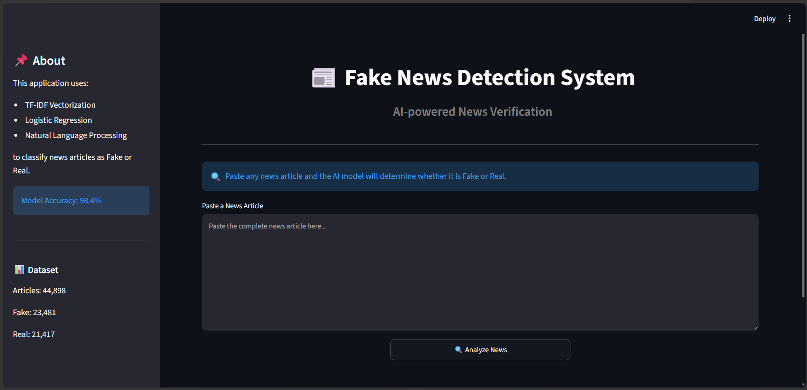
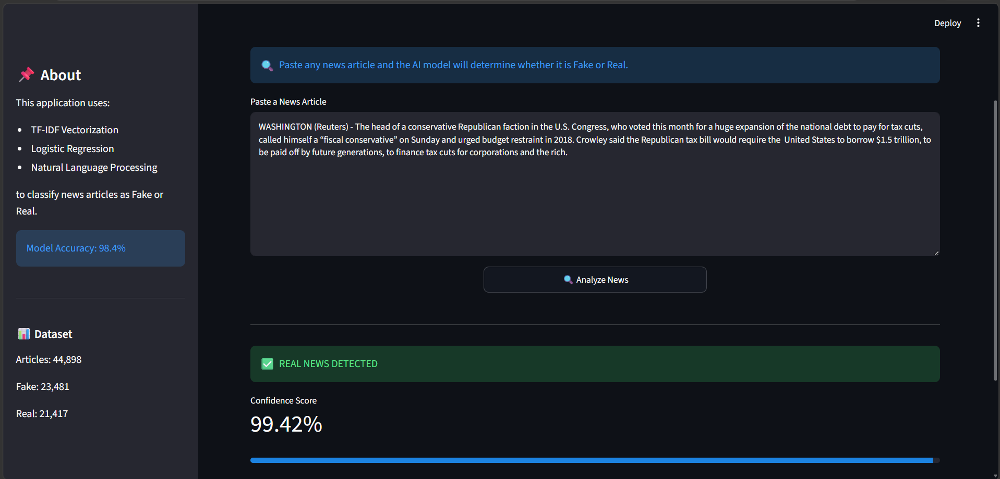
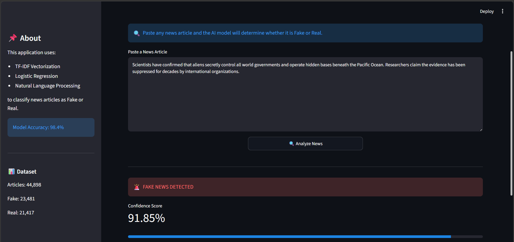

# 📰 Fake News Detection System

An NLP-based Machine Learning project that classifies news articles as **Fake** or **Real** using TF-IDF Vectorization and Logistic Regression.


## 🌐 Live Demo

[Try the App](https://fake-news-detection-d2dcmyimv8cpk2dg3ztg5h.streamlit.app/)
---

## 🚀 Features

- Fake vs Real News Classification
- TF-IDF Vectorization
- Logistic Regression Model
- Streamlit Web Application
- Confidence Score Display
- Real-time Prediction

---

## 📊 Dataset

The model was trained on a dataset containing:

- Fake News Articles: 23,481
- Real News Articles: 21,417
- Total Articles: 44,898

---

## 🛠️ Tech Stack

- Python
- Pandas
- NumPy
- Scikit-Learn
- NLP
- Streamlit
- Git & GitHub

---

## 🤖 Machine Learning Pipeline

1. Data Loading
2. Data Cleaning
3. Label Encoding
4. Dataset Merging
5. Data Shuffling
6. TF-IDF Vectorization
7. Train-Test Split (80-20)
8. Logistic Regression Training
9. Model Evaluation
10. Streamlit Deployment

---

## 📈 Model Performance

| Metric | Score |
|----------|----------|
| Test Accuracy | 98.4% |

The model achieved 98.4% accuracy on the test dataset. Training and testing accuracies were very close, indicating good generalization and minimal overfitting.

---

## 📸 Screenshots

### Home Page



### Real News Prediction



### Fake News Prediction



---

## ▶️ How To Run

Clone the repository:

```bash
git clone https://github.com/Shaswati5tech/Fake-News-Detection
```

Install dependencies:

```bash
pip install -r requirements.txt
```

Run the Streamlit app:

```bash
streamlit run app.py
```

---

## 🎯 Future Improvements

- Deep Learning Models (LSTM/BERT)
- Live News API Integration
- Fact Checking System
- News Source Verification
- Explainable AI Predictions
